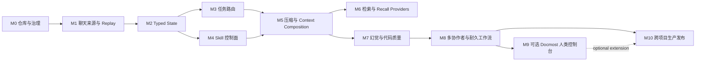

# Continuity Plane MASTER

版本：revision 97  
日期：2026-08-28  
状态：public alpha publication  
适用范围：Codex、Claude、Cursor、外置模型、本地模型及未来 provider；AlkaidLab 与其他长期软件项目；单人、子 Agent 和多人协作

## 0. 项目治理状态

| 属性 | 定义 |
|---|---|
| 仓库职责 | Provider-neutral 开发协作上下文控制面 |
| 产品形态 | 一个内聚产品、统一安装入口与可组合 capability profile |
| 部署形态 | 默认本地内嵌工具链；现有 Git forge 协作 adapter；PostgreSQL、Docmost、Temporal 和 OTel 按需启用 |
| 项目集成 | Project Profile、State MCP、CLI 和受控检索接口 |
| 当前阶段 | alpha cross-project pilot；M10-01 AlkaidLab shadow pilot |
| Canonical 治理计划 | `MASTER.md` |
| 日常恢复入口 | `STATUS.md` |
| 动态执行状态 | Phase M2 完成后由 revisioned Typed State 管理 |
| 原始会话档案 | 受控归档；规模与迁移状态记录于 `docs/migrations/` |

状态只使用：

| 状态 | 含义 |
|---|---|
| `⏳` | 未开始或等待前置条件 |
| `🟡` | 正在执行，必须有当前原子步骤和退出条件 |
| `✅` | 代码、测试、证据及所需实测全部完成 |
| `🧑‍💻` | 实现、离线测试、TDD、编译与守卫完成，只缺用户或真实环境 live 验证 |

## 1. 总目标

建立一套可移植、provider-neutral、跨项目、支持多人协作的上下文控制面。压缩、任务切换、模型切换、协作者交接、进程崩溃和检索后端故障均采用同一恢复合同：active task、最新决定、约束、阻塞、return point、已执行副作用和验证缺口由 checkpoint 与确定性 validator 恢复。

最终系统必须同时做到：

- 权威状态由 Typed State、Event Log 和 revision/CAS 管理；
- 默认安装在本地提供内嵌状态、checkpoint、Skill 和检索能力，不要求 Docker、PostgreSQL 或新增远端服务；
- 重复输入和重复检索 token 达到量化降幅，代码质量与规则遵循保持基线或提升；
- 通过有界信息访问、artifact range、代码/参考索引和候选 recall 减少直接读取量，同时保留承重 provenance 与 current-evidence verification；
- 历史记忆提供候选召回，执行权限由 validity、supersedes 和当前证据决定；
- 行业标准、OS 官方文档、软件官方文档和当前源码都能形成带版本与 provenance 的 assertion；
- 外部参考和 harness 实践通过可刷新 catalog、snapshot hash、validity 与 adoption decision 持续进入研究证据；
- MASTER 分支任务形成可计算 DAG，具备依赖、阻塞、回流、promotion、attempt budget 和完成证据；
- 共享 Work Ledger、claim/lease、scope ownership 和 current evidence 在第二个认领或副作用前发现重复工作；
- Docmost 可作为任意单人或团队安装的可选控制台，提供人类观察、审批、任务图、证据矩阵和上下文健康度；
- 同一套服务能够接入 AlkaidLab、ProjectCompute 以及未来任意项目和协作者。

## 2. 范围与权限边界

| 范围 | 合同 |
|---|---|
| Git 内容 | 保存协议、schema、代码、项目 Profile、脱敏 fixture 和治理文档 |
| 原始会话 | 保存在供应商档案或加密对象存储 |
| Platform 集成 | 通过 Project Profile 与外部接口完成；Platform Runtime、SDK、Core 和 Module 保持零依赖 |
| 权威状态提交 | 仅 State MCP 在 revision/CAS、权限与 validator 通过后执行 |
| Recall 与检索组件 | Mem0、Hindsight、Graphiti、CodeGraph、RTFM、Obsidian、Docmost 和模型提供候选或投影 |
| 承重字段 | Task State、Decision、Constraint、External Effect 和 Verification Gate 采用无损存储 |
| 组件采用 | 依据源码审查、可重复测试、故障注入和真实项目 A/B |
| 验证完整性 | TDD、编译、contract、golden、mutation、loopback、弱网、性能和 live profile 按项目要求执行 |

## 3. 目标态架构全表

`MASTER.md`、`STATUS.md` 和 [`docs/architecture/target-state.md`](docs/architecture/target-state.md) 构成默认安装到个人、协作和公开项目的人类/Agent 双读投影。MASTER 保存治理主线与完成门，STATUS 保存最小运行路由，目标态架构全表保存组件、权限、依赖和交付阶段。三者通过 revision、stable ID、evidence ref 和 validator 关联；高频事件与私有状态不复制进入 Git 文档。

完整 `context.*` Slot/Module/Backend 表、依赖图、公开项目 Markdown 准入范围和有界读取顺序由目标态架构全表维护。日常恢复先读 STATUS，再按 active leaf 展开 MASTER 和全表对应行；完整文件只用于治理或架构审计。

## 4. 权威状态、记忆和文档边界

| 对象 | 权限 | 保存位置 | 恢复规则 |
|---|---|---|---|
| MASTER | 人类主线意图和治理计划 | Git | 变更经过治理流程 |
| Typed State | 当前任务、依赖、决定、门禁和 owner | StateStore profile；SQLite 默认本地，PostgreSQL 可选共享 | expected revision/CAS |
| Event Log | 所有状态变化和 supersedes 历史 | StateStore profile + artifact manifest | append-only + hash chain |
| Checkpoint | 压缩、切换、交接的不可变恢复点 | 本地 StateStore + artifact store；共享 profile 可同步 | checksum + canary |
| Evidence/Assertion | 当前代码与权威来源的承重证据 | Git/RTFM/artifact store | authority、version、hash、validity |
| ReferenceSource/Snapshot | 外部来源、检索 revision/hash、freshness 和采用决定 | Git metadata + artifact store | change detection + supersedes review |
| Skill | 稳定协议、方法、词汇、门禁 | Git + compiled packet | version、hash、rule IDs、quarantine |
| Raw Transcript | 供应商原始对话档案 | 供应商目录或加密对象存储 | 按 retention 与受控提取策略访问 |
| Handoff/Memory | 历史候选和快速索引 | 派生存储 | background；current-evidence verification 后晋升 |
| Replay Fixture | 脱敏、最小化、带期望结果的故障样本 | Git | 每次模型/Skill/schema/provider 变更复跑 |
| Docmost | 人类控制台、审批、纠偏、promotion 和审计入口 | Docmost DB + State MCP provider | 受 authorization、revision/CAS、validator 和 promotion gate 约束 |
| Obsidian | 生成的只读 vault | generated vault | 无权威状态提交权 |
| 报告与目标态架构全表 | 治理与汇报投影 | Git/Docmost | 承重断言具有 current provenance；不能自行改变 active state |

文档分类、更新触发、容量边界、拆分、supersedes 和生成投影规则见 [`docs/policies/documentation-lifecycle.md`](docs/policies/documentation-lifecycle.md)。

## 5. 聊天记录迁移合同

原始会话保留在受控档案。项目迁移采用以下 provenance 提取流程：

```text
Provider archive
-> metadata inventory
-> project/thread classification
-> secret and personal-data scan
-> material-event extraction
-> Decision/Evidence/Constraint/Work/Preference candidates
-> current-evidence verification
-> typed import or sanitized replay fixture
```

每个导入对象必须记录：

```yaml
source_provider: codex | claude | other
source_thread_ref: opaque-hash
source_range_ref: opaque-range
project_id: string
extracted_at: rfc3339
extractor_version: string
content_sha256: sha256
classification: decision | evidence | constraint | work | preference | replay
validity: candidate | verified | stale | rejected
verified_against: [artifact-ref]
contains_sensitive_data: boolean
retention_class: ephemeral | project | audit
```

Git admission policy 排除完整 JSONL、隐藏提示词、工具凭据、访问 token、未脱敏用户数据、大段构建输出、完整 diff、模型 reasoning 和供应商专有字段。入选历史样本保留最小触发输入、必要状态、期望结果和来源 hash。

## 6. MASTER 任务 DAG



分支规则：任何新分支必须有 `parent_id`、scope、return point、exit criteria、attempt budget、expiry 和 promotion target。实验分支默认 `mainline_authority: false`；canonical queue 变更须通过 promotion gate。

### 6.1 想法接入与上下文回返合同

执行过程中出现的新想法、旁支问题或潜在架构改进先登记为 `Idea` candidate，不直接改变 active work。每个 Idea 至少绑定：

```yaml
idea_id: stable-id
parent_task_id: stable-id
source_thread_ref: opaque-hash
captured_at: rfc3339
summary: string
scope: string
status: candidate | parked | proposed | approved | rejected | superseded
return_point: stable-id
expiry: rfc3339 | null
attempt_budget: uint32 | null
promotion_target: work-id | null
evidence_refs: [artifact-ref | assertion-id]
```

Idea 的默认路由是 `capture-and-continue`：记录候选、保留当前 active leaf、继续当前任务。Idea 生命周期通过 `idea_captured`、`idea_parked`、`idea_proposed`、`idea_approved`、`idea_rejected` 和 `idea_superseded` 追加式事件管理。Idea 只有在用户明确要求切换，或经过可审计的 `switch proposal` 与 CAS 激活后，才能成为 active work。需要进入 canonical queue 的 Idea 必须经过 evidence review、scope/ownership 检查、attempt budget 和 promotion gate；未批准的 Idea 不得修改主线、Product 代码或权威状态。

当 Idea 需要立即处理时，先为原任务提交滚动 checkpoint，再写入 `task_suspended` 与 `task_activated` 事件。Checkpoint 必须保留原任务的 canonical digest、active leaf、latest decision、reverted/rejected decision、hard blocker、return point、验证缺口和禁止副作用。恢复原任务时，只加载其 Execution Packet 和 checkpoint。Execution Packet 只携带与当前任务相关的 Idea ID 和单行摘要；完整 Idea 通过 bounded lookup 展开。其他 parked/candidate Ideas 保留在状态服务，不进入 prompt、Skill 或执行权限。

压缩前冻结新的外部副作用并提交增量 checkpoint。压缩后 validator 先恢复原 active task，再允许读取 Idea 候选或发起 switch proposal。若 checkpoint、revision、path ownership 或 current evidence 不一致，权限降级为只读，禁止写代码、提交、部署和新任务派发。

Idea 分类、去重、correction 写保护、自然语言交互和回返 packet 的完整合同见 [`docs/architecture/idea-continuity.md`](docs/architecture/idea-continuity.md)。

### 6.2 Skill 编排与初始化合同

Skill 是带版本、hash、rule ID 和适用范围的规则资产。Skill 不保存 active task、动态 blocker、owner、claim、revision 或临时决定；这些字段只存在于 Typed State、Event Log、Checkpoint 和 Execution Packet。每个 Skill manifest 至少声明：

```yaml
skill_id: stable-id
version: semver
content_sha256: sha256
source_kind: builtin | external | project | user | workflow
license_ref: artifact-ref | SPDX-id
applicability: [task_kind, project_id, repo, path, operation, role, provider]
rule_ids: [stable-rule-id]
dependencies: [skill-id@range]
conflicts: [skill-id@range]
expires_at: rfc3339 | null
compatibility: [schema-version | provider-contract]
provenance_refs: [artifact-ref | assertion-id]
status: proposed | approved | active | quarantined | deprecated | rejected
```

Skill catalog 包含五类来源：

1. `builtin`：跨项目的最小核心规则，例如状态提交门、证据门、checkpoint/canary、敏感信息处理和 provider-neutral 术语。
2. `external`：第三方或组织 Skill。必须经过 license、来源、hash、依赖和安全审查，默认以候选状态进入项目。
3. `project`：项目 Profile 绑定的构建、测试、目录、官方来源和发布约束；由项目治理流程批准。
4. `user`：用户偏好和习惯的显式定制。它只能影响表达、工具偏好和非安全性流程参数，不能放宽权威状态、证据、权限或验收门。
5. `workflow`：Thinker、Executor、Verifier、review、handoff 等角色和操作流程。它描述角色允许的动作与输入输出，不赋予角色直接写权威状态的权限。

Skill resolver 按以下顺序确定结果：显式的 `Task/Goal/Experiment`、active claim 和 path owner；Project Profile 的 repo/path/operation 约束；角色与 provider adapter；manifest applicability、依赖、冲突、版本和 expiry 校验；最后才使用相似度、历史 memory 或模型生成的候选排序。候选排序不能绕过显式绑定、审批、validator 或 CAS。项目初始化可以根据仓库、验证配置和用户习惯生成 Skill proposal，但发布前必须由用户或项目治理 owner 审批，并保留 proposal、输入证据、生成器版本和批准事件。

装载采用渐进披露：`S0` bootstrap 只含安全、状态和恢复门；`S1` manifest 只含适用性与依赖元数据；`S2` compiled packet 只含当前 active leaf 所需 rule IDs 和短规则；`S3` full Skill 与 references 按需读取。进行中的任务锁定已批准的 rule set、manifest hash 和 schema/provider contract；Skill 变更、缺失路径、hash/version/digest/expiry 漂移或冲突会进入 quarantine，禁止执行，直到兼容 replay 或显式 migration 通过。所有 resolver 决策、proposal、approval、quarantine、replay 和 deprecation 都写入可审计事件，并能从 checkpoint 重建。

### 6.3 Reference 与 Harness 演进合同

外部参考按 current source、standard、OS/software official、vendor engineering、research、organization、community 和 marketplace 分类。发现器登记 canonical URL、retrieval revision/hash、authority、license、validity、refresh trigger 和 adoption status；它只能产生 candidate 和 stale signal。承重 assertion 通过 current-evidence verification 与 M7 gate 后才能进入完成证据。完整合同见 [`docs/policies/reference-evidence-lifecycle.md`](docs/policies/reference-evidence-lifecycle.md)。

每个 provider-neutral Harness Run 绑定 task revision、claim、Execution Packet hash、Skill digest、tool grants、checkpoint、effect watermark、Verification Profile、reference validity watermark 和 OTel trace。Provider transcript、session ID、goal、host checkpoint 和 workflow state 作为 provenance；task completion、决定、effect 和 promotion 仍通过 State MCP 提交。

当前候选基线按职责拆分：DeepSeek Harness 作为 M4/M5 动态插件、Skill、checkpoint、compaction、sandbox/approval 和本地持久化实现候选；Pi Coding Agent 现行 compaction 作为 M5 cut point、split-turn、hook、usage/cache 对照；Pi durable AgentHarness 规范作为 M8 `op.state`、effect sandwich、reserved ID、replay policy 和 crash/race 测试 oracle；Cordis 论文作为 M4 动态组件依赖、revertible registration 和生命周期依据。Cordis inverse 只覆盖运行时管理的 context transformation 和 registration；外部 effect 仍使用 State MCP authorization、effect ledger、幂等键和显式补偿。上述来源均保持 candidate，不能从 provider session、summary、transcript 或 durable log 提交项目级权威状态。

### 6.4 有界信息访问与项目适配合同

控制面通过 `RetrievalReceipt` 记录查询类型、source revision/hash、选中范围、读取与输出 bytes、freshness 和验证结果。Execution Packet 只装载当前 active leaf 所需字段、锁定 Skill rule IDs、承重 evidence refs 和唯一 next action；完整历史、报告、大型日志、候选 Idea 和 memory 通过 opaque ref 进行 bounded expansion。外置 memory、索引、缓存和 reviewer 在 provider 故障或结果冲突时降级，不改变权威状态。

安装到项目后，系统可以从已验证 run、明确用户纠正和失败 fixture 生成 versioned `ProjectAdaptation` proposal。proposal 可调整检索顺序、常用目录、Skill applicability、验证提示和非安全表达偏好；它不能改变 active task、claim、path ownership、authorization、validator、evidence gate、promotion gate、retention 或 provider-neutral 协议。proposal 必须经过 shadow/A-B replay、safety veto、审批、expiry、rollback 和 opt-out/reset 约束后才能影响新 packet。详细合同见 [`docs/architecture/adaptive-information-plane.md`](docs/architecture/adaptive-information-plane.md)。

## 7. 执行台账

各 Campaign 使用独立二级章节，避免单一台账章节超过容量门。任务状态由治理 revision 维护；active leaf、blocker、next action 和当期验证数据只进入 `STATUS.md` 与 evidence projection。

## 7.1 M0 仓库与治理

| ID | 状态 | 内容 | 效果 | 目的 | 依赖 | 完成门 |
|---|---|---|---|---|---|---|
| M0-01 | ✅ | 建立独立 Git 仓库 | 与 ProjectCompute、Platform 生命周期解耦 | 任意项目可复用 | 无 | repo root、main branch、边界文件存在 |
| M0-02 | ✅ | 建立 canonical `MASTER.md` | 主线、DAG、状态和完成门统一 | 计划变更纳入治理 | M0-01 | 文档结构校验通过 |
| M0-03 | ✅ | 建立原始会话 Git admission policy | 控制隐私、仓库体积和上下文输入 | 保持仓库安全可移植 | M0-01 | `.gitignore` 与 ingestion policy 一致 |
| M0-04 | ✅ | 迁入上下文可靠性评估 | 研究证据进入项目资料集 | 支持研究结论复用 | M0-01 | 来源 hash 与编辑修订记录完整 |
| M0-05 | ✅ | 建立短小 `STATUS.md` 路由器 | 日常恢复通过定向引用完成 | 控制 MASTER 装载成本 | M0-02 | 当前任务、阻塞、next action 和文档引用可在小文件恢复 |
| M0-06 | ✅ | 建立正式文档语言规范 | 规范使用稳定属性、权限和验收指标 | 保持长期文档一致性 | M0-02 | style policy 与文档审计通过 |
| M0-07 | 🧑‍💻 | 建立 schema/version/release governance | 所有协议可演进和回放 | 保障 checkpoint 兼容性 | M0-02 | registry/hash、transition、migration/replay/rollback 和 quarantine 离线验收完成；runtime State MCP migration 待 M2 |
| M0-08 | 🧑‍💻 | 建立 ReferenceSource/Snapshot lifecycle、candidate catalog 与 harness 采用评估 | 外部资料可持续发现、固定、刷新、失效和复用 | 让研究证据进入后续 schema、adapter 与实验 | M0-03/M0-06 | Codex/Claude、DeepSeek、Pi 和 Cordis 来源带 URL/revision/hash/license/refresh/adoption；7 个 catalog tests 通过；State/Watcher live integration 待后续阶段 |
| M0-09 | ✅ | 建立项目 self-dogfood observation protocol 与首个 baseline | 研发过程记录 compaction、Skill 装载、计划演进和质量门后的交付速度 | 以项目自身数据验证逐步优化 | M0-05/M0-07 | 历史 baseline 与自动 `context.*` emitter 均可复核；M5-07 `8000` events、七类覆盖 100%、四类 veto `4000/4000`；provider 原生指标缺失时保持 `unavailable` |
| M0-10 | ✅ | 建立文档分类、更新触发、容量预算、supersedes 和生成投影生命周期 | MASTER、STATUS、细分文档和投影保持可定位、可更新、可收敛 | 防止长期陈旧与无界扩展 | M0-05/M0-06/M0-07 | policy validator、STATUS 与 evidence 漂移、重复全文、过期引用、容量超限和权限故障测试通过；拆分后恢复字段 100% |
| M0-11 | ✅ | 建立 Git branch/commit/PR/merge 与 staged admission 合同 | Git 集成边界可回放且不冒充权威状态 | 让单人、多 AI 和多人协作具有一致的审计与发布节奏 | M0-02/M0-03/M0-09 | packet/receipt strict schema、26/26 contract tests、index-only transcript/secret/private-path admission、fixture provenance revalidation、regular-merge replay 和 first-commit tree audit 通过 |
| M0-12 | ✅ | 建立 provider-neutral CI Verification Profile、统一 verifier 与 Gitea required jobs | push/PR 自动执行 test、compile、data/schema/projection、privacy、benchmark 和 secret gates | 让本地开发、协作者与托管平台使用同一可复现验收边界 | M0-03/M0-07/M0-09 | 14 个 verifier 正反测试、102/102 repository tests、compile 和 Gitleaks 本地通过；push runs 1016/1017 与 pull_request run 1018 通过；`main` 禁止 direct/force push 并要求 4 个实测 status contexts |

## 7.2 M1 聊天来源与 Replay Corpus

| ID | 状态 | 内容 | 效果 | 目的 | 依赖 | 完成门 |
|---|---|---|---|---|---|---|
| M1-01 | ✅ | 通过元数据盘点 Codex/Claude/派生 memory | 获得来源规模基线 | 制定归档与提取策略 | M0-03 | 文件数、bytes、大文件数已记录 |
| M1-02 | 🧑‍💻 | 建立 source registry 和 opaque thread IDs | 来源可追溯；本机路径与 provider ID 受隔离 | 支持跨机器迁移 | M1-01 | 同一来源稳定映射，公开输出无原 ID；15 个 TDD/边界测试通过 |
| M1-03 | 🧑‍💻 | 建立 secret/PII/license sanitizer | fixture/state admission 由 sanitizer 门控制 | 支持共享与未来开源 | M1-02 | secret、PII、machine path、SPDX license 注入测试通过；有 findings 或无 provenance 时 admission 为 0 |
| M1-04 | ✅ | 从 ALTP/ECN/弱网/10Gbps 抽取首批 40 个 fixtures | 真实返工形成回归集 | 提供真实项目评估样本 | M1-03 | 40/40 包含输入、期望状态、来源/range/content hash、脱敏证明和 current evidence；独立复验与 corpus hash 通过 |
| M1-05 | ✅ | 覆盖 task switch、并行工作、重复工作、stale Skill、SIGKILL、503、checkpoint 损坏和并发 CAS | 16 个 contract fixture 覆盖 E0-E9；runtime evidence 边界显式保留 | 建立完整 replay 覆盖 | M1-04 | E0-E9 10/10；required scenarios 10/10；contract coverage 100%；runtime coverage 0% 且未产生越权完成声明 |
| M1-06 | 🧑‍💻 | 建立 archive retention/export/delete | 可移植、可撤销、可审计 | 满足长期协作与隐私治理 | M1-02 | 9 个 retention/export/import/tombstone/deletion-proof 合同测试通过；production adapter 与 backend receipt 待 M2/M8/M10 |
| M1-07 | 🧑‍💻 | E0/E1 context compression 与 Execution Packet benchmark | 量化恢复率、旧决定复活、Skill 输入和 token proxy | 建立可复现实验基线 | M1-03/M1-04 | 合成 4 场景与真实 40 场景可重复；真实 corpus 在 768 字符时 E1 恢复 100%、旧决定复活 0；live tokenizer/A-B 待 M5/M7 |

## 7.3 M2 Typed State、Event 与 Checkpoint

| ID | 状态 | 内容 | 效果 | 目的 | 依赖 | 完成门 |
|---|---|---|---|---|---|---|
| M2-01 | ✅ | 定义 Project/Work/Claim/Idea/Decision/Constraint/Evidence/Blocker/Effect schema | 项目级 active work、共享 Work Ledger 和个人派生视图变成类型合同 | 无损恢复并阻止重复工作 | M0-07/M1-04/M1-05 | strict schema 注册；4/4 solo/multi-worker、active/completed overlap、claim/effect scope 和 supersedes fixture canonical round-trip；12/12 定向测试通过 |
| M2-02 | ✅ | 定义 append-only Event、supersedes 和 reducer | 历史可 replay | 旧决定复活率为 0 | M2-01 | strict Event schema 注册；1/1 versioned replay fixture 与 snapshot byte-equivalent；14/14 定向测试通过；tamper、gap、断链、未知 supersedes、终态 Work/Decision 复活均被拒绝 |
| M2-03 | ✅ | PostgreSQL optional shared backend 的 revision/CAS relational state store | 并发冲突显式返回 | 提供按需启用的强一致多 writer 能力 | M2-02 | 11/11 定向测试；8/8 显式并发 conflict；silent overwrite 0；run 1039 通过；4 Event shadow replay 与数据库读回一致；默认安装依赖 PostgreSQL 为 0 |
| M2-04 | ✅ | content-addressed artifact store | 大日志和 diff 通过 artifact ref 引用 | 降 token 并保存证据 | M2-01 | ArtifactRef strict schema；20/20 定向测试；streamed SHA-256、atomic publication、并发去重、bounded range 和损坏检测通过；1 MiB 到 8 KiB context output bytes 下降 99.2188%；默认外部服务 0 |
| M2-05 | ✅ | State MCP read/commit/claim/effect API | 各 agent/provider 使用统一协议 | provider-neutral | M2-08/M2-09 | 26/26 contract/auth tests；默认拒绝、trusted actor、CAS、validator、concurrent idempotency、strict receipt、backend busy、claim/effect provenance 和 torn-read detection 通过；四工具 SQLite/PostgreSQL live parity 1/1 |
| M2-06 | ✅ | immutable checkpoint 与 canary manifest | 压缩和交接可验证 | 建立确定性恢复 | M2-04/M2-05 | strict manifest 注册；snapshot/manifest 双层 CAS；18 个关键字段恢复 100%；missing/tampered/stale/unknown/oversized 全部 fail-closed；SQLite 零服务 restore p95 <2s |
| M2-07 | ✅ | Project Profile、Project Charter、WorkSource 与 ProjectAdaptation typed schema | 项目接入、方向探索、task source、repository topology、Work obligation 和自适应候选可版本化、可回放 | 支持个人/团队、模块化/非模块化项目并降低重复读取 | M2-01/M0-09 | strict schema 与 runtime validator 注册；35/35 定向测试覆盖 obligation 权限与终态依据、四档 requested runtime profile 与 manifest 权限边界、三个独立配置轴、modular/monolith/mixed scope、typed applicability、SemVer 2.0.0、deterministic hash、trusted time、proposal/activation revision、active snapshot replay、同 lane rollback、approval 和 canonical round-trip；两名独立 Verifier 复审 High 0、Medium 0 |
| M2-08 | ✅ | backend-neutral StateStore SPI 与 capability manifest | core 根据一致性、共享、离线和资源能力选择 adapter | 去除 PostgreSQL 对普通路径的隐式依赖 | M2-02/M2-03 | authoritative/projection Protocol 与 runtime 一致；schema/document/runtime round-trip 等价；通用 conformance 覆盖 defensive copy、unknown project、replay mismatch、duplicate identity、sequence/hash-head、second Event 和 atomic rollback；独立审查无 High/Medium finding |
| M2-09 | 🧑‍💻 | SQLite embedded local state/event/checkpoint backend | 单人和本机多 Agent 获得零独立服务的持久恢复 | 建立默认轻量运行路径 | M2-08 | WAL/BEGIN IMMEDIATE、CAS、append-only、崩溃恢复和损坏检测通过；默认用户管理 daemon/Docker/PostgreSQL 均为 0；Windows/macOS/Linux fixture 通过 |

## 7.4 M3 任务图与智能切换

| ID | 状态 | 内容 | 效果 | 目的 | 依赖 | 完成门 |
|---|---|---|---|---|---|---|
| M3-01 | 🧑‍💻 | 建立 Campaign/Goal/Work/Experiment DAG | 分支、阻塞、回流可计算 | 将发散与停滞转化为可检测状态 | M2-08/M2-09 | strict graph、typed-state v2 migration、replay/rollback、无环、无孤儿、无无回流分支；26/26 定向测试与 1,000 节点 p95 4.0 ms 通过；M2-09 Windows/macOS native fixture 仍待补；验收见 `docs/migrations/m3-01-task-graph-acceptance-2026-08-14.md` |
| M3-02 | 🧑‍💻 | sticky task router | 默认保持当前 active leaf | 保持压缩前后任务一致 | M3-01 | 16/16 定向测试、route replay、1,000 决策有界性通过；验收见 `docs/migrations/m3-02-sticky-router-acceptance-2026-08-14.md` |
| M3-03 | 🧑‍💻 | continue/child/interrupt/switch/correction 事件 | 切换可审计、可恢复 | 以信号和事件驱动任务切换 | M3-02 | 27/27 定向测试、return frame、route replay、SQLite CAS 通过；PostgreSQL live parity 待补；验收见 `docs/migrations/m3-03-route-events-acceptance-2026-08-14.md` |
| M3-04 | 🧑‍💻 | active/claim/scope-owner 副作用门 | repo/path/symbol/capability/effect binding 冲突时授予只读权限 | 将副作用绑定至权威任务 | M3-03 | 23/23 定向测试、10,000 gate evaluations 和 pending-effect deny benchmark 通过；验收见 `docs/migrations/m3-04-effect-scope-gate-acceptance-2026-08-14.md` |
| M3-05 | 🧑‍💻 | attempt budget、expiry、promotion gate | 实验按预算和期限运行 | 实验发现有序回流 MASTER | M3-01 | 27/27 定向测试、40/40 attempt→proposal→approval、3 Event/1 attempt/2 promotion 每样本通过；验收见 `docs/migrations/m3-05-experiment-lifecycle-acceptance-2026-08-14.md` |
| M3-06 | ✅ | Idea candidate、parking、capture-and-continue 与 switch proposal | 新想法不污染当前 active leaf | 保留价值并控制上下文切换 | M3-03/M3-05 | 15/15 定向测试、40/40 zero-service capture、active execution authority mutation 0；验收见 `docs/migrations/m3-06-idea-continuity-acceptance-2026-08-14.md` |
| M3-07 | ✅ | Idea relationship、dedupe、correction、urgency 与 impact review | 重复或跨域想法形成有界候选队列 | 支持持续输入并避免 prompt/主线污染 | M3-06/M6-02 | v3→v4 migration receipt、Idea v2 dedupe/occurrence、relationship cycle gate、review/protection/release；40/40 benchmark；dedupe/occurrence/packet `100%`，protected writes/terminal revival/unverified release `0`，p95 `15.362956 ms`；验收见 `docs/migrations/m3-07-idea-review-acceptance-2026-08-14.md` |
| M3-08 | ✅ | 输入意图、blocking decision、next-ready selector 与 bounded escalation taxonomy | non-blocking input 保持 active leaf，只有可证明的阻塞需要询问或停止 | 防止短消息、Idea、状态问答和分析偏移重置主线 | M3-03/M3-06/M3-07 | 4 份 strict schema 与 current provenance；1,000/1,000 zero-service decision、125/125 负向 fixture；ready required missed、premature stop、untyped ask、incomplete escalation、active leaf change 和 replay mismatch 均为 0；p95 `0.230881 ms`；验收见 `docs/migrations/m3-08-continuation-dispatch-acceptance-2026-08-14.md` |

## 7.5 M4 Skill 控制面

| ID | 状态 | 内容 | 效果 | 目的 | 依赖 | 完成门 |
|---|---|---|---|---|---|---|
| M4-01 | ✅ | Skill manifest/version/hash/applicability schema | Skill 可选择、可锁定、可追溯 | 控制压缩恢复的规则装载范围 | M2-01 | `context.skill-manifest-set/v1alpha1` strict schema、SPDX snapshot、runtime validator；33/33 定向测试（含 26/26 原始合同）；registry hash、fixture canonical round-trip、独立审查 High 0/Medium 0 通过 |
| M4-02 | ✅ | 稳定 rule IDs 与 compiled packet | 当前任务规则形成有界 packet | 降低重复 token | M4-01 | `context.compiled-skill-packet/v1alpha1` strict schema、dependency closure、rule binding coverage、source digest verification、canonical fixture、registry hash；17/17 定向测试；static metadata proxy 72.666%；独立审查 High 0/Medium 0 通过 |
| M4-03 | ✅ | missing path/digest/version/expiry validator | 漂移 Skill 自动 quarantine | stale rule 激活率为 0 | M4-01 | 33/33 显式负变体拦截；26/26 定向测试；High/Medium 复审为 0 |
| M4-04 | ✅ | S0-S3 分层加载 | 恢复装载 1-2 KB bootstrap 与 2-6 KB packet | 缩短恢复热路径 | M4-02/M4-03 | strict plan/load schema、M4-03 allow gate、host-owned authorizer 和 canonical fixture 通过；35/35 定向测试；loader p95 `<10 ms`；向 composition 转发的 Skill 正文字节相对 all-layer control 下降 `>=60%`；provider token/真实压缩由 M4-05/M5 验收 |
| M4-05 | ✅ | Codex/Claude/其他 provider Skill adapter | 同一规则合同跨工具使用 | 可移植协作 | M4-04 | strict effect/probe schema 与官方 Codex/Claude Skill surface 通过；24/24 定向测试；40 组 byte-distinct compositions 生成 80/80 validated effects 与 240 次 compose；neutral mismatch `0/40`、provider replay mismatch `0/80`、state-write declaration `0/80`；本地 adapter p95 `<10 ms`；独立复核 High 0/Medium 0；provider process/token/cache/规则遵循/真实压缩未在本阶段声明 |
| M4-06 | ✅ | Skill 变更 replay 与兼容锁 | 进行中任务固定使用已记录 rule set | 可持续迭代替换 | M4-03 | lock/decision/migration/probe strict schema 注册；selected manifest digest、exact provider applicability/contract 与 live adapter surface 重算；40 变更样本中未选中 metadata `8/8 compatible`，selected identity/provider contract `32/32 migration_required`；unauthorized gated composition `0/32`；synthetic verifier-authorized migration `4/4` 可 replay/rollback；assessment p95 `<10 ms` |
| M4-07 | ✅ | Built-in、External、Project、User、Workflow Skill catalog 与动态组件候选准入 | 来源、license、provenance、依赖、reversible registration 和权限边界可审计 | 管理可复用与项目专属规则 | M4-01/M0-07/M4-06 | `context.skill-catalog/v1alpha1` strict schema、registry hash、五类来源 `5/5` 合法 entry、18/18 admission/quarantine 负变体、candidate projection、canonical manifest digest 的 M4-06 exact identity binding 和 canonical fixture 通过；固定 fixture validator p95 `0.0140 ms`；DeepSeek Skill/plugin 与 Cordis dependency/lifecycle candidate 固定 provenance、license 和隔离边界；Cordis license 未决时保持 reference-only |
| M4-08 | 🧑‍💻 | 项目初始化与用户习惯 Skill proposal | 从仓库、验证配置和显式偏好生成可审查候选 | 缩短接入并保持用户控制 | M4-07/M7-03 | `context.skill-proposal/v1alpha1` strict schema、M4-01 manifest schema reuse、64 KiB preflight/canonical input、16,384 Unicode scalar/64 KiB UTF-8 content 与 128 KiB output bound、strict SemVer/ID/timestamp gate、set-like input canonicalization、explicit license policy、Project/User provenance isolation、expected-time-bound replay verifier、candidate-only body asset、M4-03 resolver 和 fixture replay 通过；34/34 定向测试；200 次 replay mismatch `0`，40/40 fact 变体 fingerprint/content digest 唯一，权限真值 `0`；production Verification Profile adapter 待 M7-03 |
| M4-09 | ✅ | role/operation-aware Skill resolver | Thinker、Executor、Verifier 和 provider 获得最小规则集 | 控制动作权限与上下文成本 | M3-04/M4-04/M4-07 | `context.skill-resolution-request/v1alpha1`、`context.skill-resolution-decision/v1alpha1` 与 benchmark schema；同 kind OR、跨 kind AND、segment-prefix path、精确 provider contract、dependency closure、priority conflict、expiry quarantine；`1000/1000` replay、`125/125` negative quarantine、replay/role/provider/authority fault `0`；universe→selected reduction `33.3333%`、p95 `1.109641 ms`；验收见 `docs/migrations/m4-09-skill-resolver-acceptance-2026-08-14.md` |
| M4-10 | 🧑‍💻 | 官方 Skill、Agent Skills standard、GitHub 和 marketplace catalog adapter | 发现结果带直接 URL、revision、hash、license 和 trust tier | 智能复用外部能力并阻止未审查加载 | M4-07/M0-07 | `context.external-skill-source-snapshot/v1alpha1` strict schema、version/hash 固定 adapter policy、pinned Git tree evidence、本地 CAS staging、四类来源 snapshot/quarantine/offline replay 与 M4-07 candidate-only projection 通过；27/27 定向测试；生产 streaming acquisition、authorization/audit 待 M7/M8 |

## 7.6 M5 压缩与 Context Composition

| ID | 状态 | 内容 | 效果 | 目的 | 依赖 | 完成门 |
|---|---|---|---|---|---|---|
| M5-01 | ✅ | Execution Packet composer | 当前叶包含任务、规则、证据、相关 Idea refs 和唯一 next action | 恢复成本与项目总历史解耦 | M3-03/M4-04 | packet 4-12 KB 且 canary 100%；`docs/migrations/m5-01-execution-packet-acceptance-2026-08-14.md` |
| M5-02 | ✅ | material event 滚动 checkpoint 与 provider compaction hook adapter | PreCompact 提交增量 delta；Pi hook 与 DeepSeek semantic checkpoint 进入统一 bracket | 提高压缩速度并固定 host 适配边界 | M2-06/M5-01 | `1000/1000` replay；delta `1093 B`；PreCompact p95 `0.666804 ms`；watermark/replay/authority mismatch `0`；外部服务 `0`；验收见 `docs/migrations/m5-02-compaction-checkpoint-acceptance-2026-08-14.md` |
| M5-03 | ✅ | PostCompact deterministic canary 与 host compaction 对照 | 恢复错误在写代码前被阻断；Pi cut point/split-turn 与 DeepSeek checkpoint/compaction 进入 fixture | 保证一致性 | M5-01/M5-02 | `1000/1000` restore；decision/constraint/work `100%`；`8000/8000` fault injection fail closed；p95 `1.125964 ms`；authority violation `0`；验收见 `docs/migrations/m5-03-postcompact-canary-acceptance-2026-08-15.md` |
| M5-04 | ✅ | artifact ref 与 bounded expansion | 大输出按需展开 | 降低 token 和注意力污染 | M2-04 | `1000/1000` bounded expansion；returned bytes ≤ `256 B`（实测 max `88 B`）；预算/digest fault `2000/2000` fail closed；prompt bytes reduction `>0`；external=0；验收见 `docs/migrations/m5-04-bounded-expansion-acceptance-2026-08-15.md` |
| M5-05 | ✅ | token/cache/retrieval 与 compaction accounting | 形成成本、时延、cut point 和 cache invalidation 明细 | 以实测数据确定优化优先级 | M5-01 | `1000/1000` accounting；provider measured `0`、unavailable `2`；local metrics `5/route`；false provider claims `0`；同 corpus/budget route replay `0`；验收见 `docs/migrations/m5-05-context-accounting-acceptance-2026-08-15.md` |
| M5-06 | ✅ | Idea-aware checkpoint 与 context return packet | 压缩、切换后可回到原任务 | 保留 return point、相关 Idea refs 和禁止副作用 | M3-06/M5-03 | `1000/1000` replay；原任务与 return point 恢复 100%；Idea 正文复制和 candidate authority `0`；六类 fault `6000/6000`；packet `1983 B`；验收见 `docs/migrations/m5-06-idea-return-packet-acceptance-2026-08-15.md` |
| M5-07 | ✅ | Project dogfood compaction/input-routing/Skill/plan/delivery/multi-Agent observation emitter | 每次恢复、消息或 Idea 路由、Skill 选择、计划演进、Agent dispatch/handoff 和 accepted delivery 产生可比较事件 | 持续验证控制面是否真实优化自身研发与交付速度 | M0-09/M4-04/M5-05/M8-04 | `1000/1000` replay、`8000` events；七类覆盖 `1000000/1000000`；四类 veto `4000/4000`；replay/authority/external `0`；验收见 `docs/migrations/m5-07-dogfood-emitter-acceptance-2026-08-15.md` |
| M5-08 | ✅ | Continuation Cursor、durable operation state 与 anti-reset canary | 保存 last durable action、in-flight phase、已确认输入、reserved effect IDs、replay policy 和恢复响应模式 | 压缩后从原子执行点继续并避免重复解释 | M2-02/M2-06/M5-01 | `1000/1000` replay；continuation fields `10000/10000`；十类 fault `10000/10000`；首动作错配与已确认输入重播 `0`；恢复读取 `3328/4096 B`；验收见 `docs/migrations/m5-08-durable-continuation-acceptance-2026-08-15.md` |

## 7.7 M6 检索、代码图与 Recall Providers

| ID | 状态 | 内容 | 效果 | 目的 | 依赖 | 完成门 |
|---|---|---|---|---|---|---|
| M6-01 | ✅ | 固化 `rg -> Zoekt -> LSP -> SCIP -> RTFM` 路由 | 按问题选择最小工具 | 减少重复全仓扫描 | M5-04 | strict plan/receipt/benchmark schema；五类固定 route 完成 `1000/1000` replay iterations、`5000/5000` decisions；precision/recall/freshness `1.0`；验收见 `docs/migrations/m6-retrieval-recall-acceptance-2026-08-15.md#m6-01-bounded-retrieval-route` |
| M6-02 | ✅ | CodeGraph 跨仓影响线索 | 图关系与精确检索联合使用 | 控制图索引遗漏风险 | M6-01 | 每条 clue 具备 `rg + LSP` qualified-symbol 双检并绑定 trusted repository/path；missing verifier、duplicate、伪 module 和 same-name pollution fail closed；验收见同一 M6 evidence |
| M6-03 | ✅ | Recall Provider SPI | Mem0/Hindsight/Graphiti 可替换 | 新技术可消融和替换 | M2-05 | candidate-only/current-stale receipt 与 `503` degraded empty receipt 通过；State failure `0`；external active provider `0` |
| M6-04 | ✅ | memory 消融测试 | Provider 准入依据真实增益 | 建立可重复的组件准入机制 | M6-03 | `reference_fixture_conformance_only` paired fixture `1000` cases：accuracy `0.6 -> 0.9`、p=`9.82e-91`；stale revival/authority/503 State failure `0`；未宣称 external memory 增益 |
| M6-05 | ✅ | 外置/本地 reviewer adapter | 难题和 handoff 获得第二意见 | 提高审查强度 | M5-01 | local/deferred/timeout fixture 通过且 external call `0`；State/completion authority `0` |
| M6-06 | ✅ | MCP Registry/provider admission adapter | MCP server 发现、publisher、license、auth 和 tool scope 可审计 | 连接器按项目和操作受控启用 | M4-10/M2-05 | `.invalid` local registry fixture 的 revision/content digest 固定；official registry 与 State MCP route 需外部 trusted anchor；`1000` unauthorized requests 的 write/effect activation `0`；invocation `0` |
| M6-07 | ✅ | RetrievalReceipt、bounded expansion 与 index/cache freshness | 外置资料只按最小范围进入 packet，重复读取可计量 | 减少直接读取并保持 current evidence | M2-04/M5-04/M7-01 | cache hit 解析并绑定 prior miss receipt lineage；receipt provenance 与 bearing assertion `100%`；fixed E5 bytes `6,720,000 -> 3,360,000`，下降 `50%`；未宣称 provider token 降幅 |

## 7.8 M7 幻觉、证据与代码质量

| ID | 状态 | 内容 | 效果 | 目的 | 依赖 | 完成门 |
|---|---|---|---|---|---|---|
| M7-01 | ✅ | assertion authority/version/hash/validity | 承重结论可追溯 | 始终参考当前官方与代码证据 | M6-01 | strict assertion provenance schema；current code/State 与 retrieval receipt 必须解析并重算 digest；candidate/historical bearing、expiry 与伪路径 fail closed；committed coverage `1.0`；验收见 M6 evidence |
| M7-02 | ✅ | claim-evidence gate | 无证据完成声明和臆测路径被阻断 | 降低幻觉进入代码 | M7-01 | `context.claim-evidence-gate/v1alpha1` 与 benchmark strict schema；completion/path/verification/decision/constraint authority policy 固定；`1000/1000` replay，750/750 负向样本拒绝，false allow/deny `0`；State/completion authority `0`；验收见 `docs/migrations/m7-02-claim-evidence-gate-acceptance-2026-08-16.md` |
| M7-03 | ✅ | 项目化 Verification Profile | 各项目使用匹配的 TDD/build/live 门 | 保持通用协议与项目验证差异 | M2-01 | AlkaidLab 与 `portable-python-library` profile；required/conditional/optional gate、TDD red/green、adapter、run receipt 和 decision 合同；12/12 focused，1,000/1,000 replay，false allow/deny `0/0`，State/completion authority `0`；验收见 `docs/migrations/m7-03-verification-profile-acceptance-2026-08-16.md` |
| M7-04 | ✅ | 同模型同预算 patch A/B 盲评 | 隔离记忆系统对代码质量的真实影响 | 使用客观质量指标评估 | M7-02/M7-03 | opaque verifier packet、typed randomizer/score/quality provenance、独立 principal、严格 9 schema；25/25 focused，1,000/1,000 replay，false admit/reject `0/0`，external/State/completion authority `0`；仅为离线合同证据，真实 provider A/B 留给 M10；验收见 `docs/migrations/m7-04-patch-ab-evaluation-acceptance-2026-08-16.md` |
| M7-05 | ✅ | affected graph 与测试选择 | 缩短验证时间并保持完整覆盖 | 提高大项目效率 | M6-01/M7-03 | trusted change-set、graph/inventory derivation、独立 golden matrix 和 receipt；21/21 focused，1,000/1,000 scenario replay，missed/unsafe/fallback/replay mismatch `0`；本仓命令 `3,313,235,065 ns -> 94,873,214 ns`，wall-time reduction `97.13%`，达到 `>=30%`；State/completion authority `0`；验收见 `docs/migrations/m7-05-affected-test-selection-acceptance-2026-08-16.md` |
| M7-06 | ✅ | ReferenceWatcher、freshness、hash change 与 assertion supersedes | 上游文档和标准变化可审计地使旧证据失效 | 持续吸收新资料并阻止 stale 结论 | M0-08/M7-01 | trusted watch/observation/decision、registry-bound time verifier 和 strict schema；22/22 focused，1,000/1,000 replay，revision/hash change `400/400` stale/quarantine，unreviewed completion `0/800`，adversarial rejection `2,600/2,600`，authority/external calls `0`；验收见 `docs/migrations/m7-06-reference-watcher-acceptance-2026-08-16.md` |

## 7.9 M8 多协作者与耐久执行

| ID | 状态 | 内容 | 效果 | 目的 | 依赖 | 完成门 |
|---|---|---|---|---|---|---|
| M8-01 | ✅ | DBOS checkpoint/effect workflow 与 harness crash fixture | 本地崩溃恢复和幂等；DeepSeek runnable checkpoint 与 Pi effect sandwich 形成对照矩阵 | 单机可靠运行 | M5-03 | local-embedded durable operation 与 14 个 strict schema；Typed State v5/State MCP v2 及 v4↔v5 receipt 的 replay/rollback 边界通过；9 个 crash point、`180/180` terminal recovery、180 semantic effects、200 adapter calls、20 deduplications、重复 semantic effect `0`、restore p95 `105.039451 ms`；DeepSeek pinned fixture `2/2` 与真实 `SIGKILL` `2/2`；Pi 保持 scaffold oracle；验收见 `docs/migrations/m8-01-durable-operation-acceptance-2026-08-16.md` |
| M8-02 | ✅ | 共享 Work Ledger、lease、claim、scope ownership、heartbeat 和 expiry | 所有协作者看到同 revision active/completed work；过期或撤销 worker 可安全 reclaim | 团队协作并避免无感重复开发 | M3-04/M8-01 | Typed State v6、State MCP v3、capability v2、SQLite local coordinator 和 repeatable migration journal；81/81 focused；10 类场景 `10000/10000`，orphan reclaim `1000/1000`；静默覆盖、重复 claim/effect、post-revoke effect、old-worker admission、Event/revision/hash mismatch 均为 `0`；p95 `0.528895 ms`；验收见 `docs/migrations/m8-02-shared-work-acceptance-2026-08-16.md` |
| M8-03 | ✅ | Temporal 长流程与 Continue-As-New | 跨服务、长周期工作可 replay | 大型团队生产化 | M8-02 | provider-neutral workflow、State MCP backend binding、真实 local runner、跨代时间、event identity、receipt semantics、bounded payload 和 optional Temporal adapter 通过；`45` pass、`1` optional SDK skip；三代链 `1000/1000`、`7000/7000` faults、veto 指标全 `0`、p95 `21.125590 ms`；持久 receipt 重启解析、project-scoped request identity、binding 派生字段和 worker/core implementation 复核通过；High/Medium 审查 `0`；验收见 `docs/migrations/m8-03-temporal-workflow-acceptance-2026-08-16.md` |
| M8-04 | ✅ | OTel `context.*` trace | 切换、压缩、检索、返工可观察 | 持续优化而非凭感觉 | M5-05 | local trace `1000/1000`、`8000` events、八类覆盖 100%；binding/hash/evidence/authority failure `0`；OTel 未配置 `1000/1000 unavailable`；验收见 `docs/migrations/m8-04-context-trace-acceptance-2026-08-15.md` |
| M8-05 | ✅ | 权限、审计、tenant/project 隔离 | 协作者访问范围与授权一致 | 安全共享 | M2-05/M8-02 | exact policy digest、grant expiry/revocation、authorization-before-lookup、generic denial、tenant-local audit hash chain、SQLite append-only/restart/time/connection gates、replay time monotonicity 与 project-scoped request receipt 通过；focused `22/22`；allow `1000/1000`，unauthorized `9000/9000`，audit failure `1000/1000`；veto 指标全 `0`；p95 `1.159996 ms`；验收见 `docs/migrations/m8-05-authorization-audit-acceptance-2026-08-16.md` |
| M8-06 | ✅ | Provider-neutral Harness Run、durable operation、multi-Agent fan-out/fan-in 与 feedback-loop contract | model、packet、工具、权限、checkpoint、handoff、evidence、effect 和 trace 绑定同一 State revision | 使 Codex/Claude/DeepSeek host 与 worker 能力可替换和可回放 | M2-05/M4-05/M5-03/M8-04 | strict run/event/handoff/benchmark schema、registry hash、`11/11` focused；provider drift、worker loss authority、invalid effect、stale handoff、first-action mismatch、dual-provider replay 各 `1000/1000`；fan-out `2000`、fan-in `1000/1000`；p95 `2.344702 ms < 50 ms`；provider/external calls `0`；验收见 `docs/migrations/m8-06-harness-run-acceptance-2026-08-16.md` |
| M8-07 | ✅ | ProjectAdaptation observe/propose/shadow/approve/rollback loop | 项目和用户习惯可在安全边界内持续优化 | 使安装后的控制面随实测使用演进 | M5-07/M6-07/M7-04 | strict observation/proposal/replay/transition/benchmark schema、registry hash、focused `11/11`；`2000/2000` deterministic replay；未批准激活拒绝 `1000/1000`；激活 `2000/2000`；rollback veto 恢复 `1000/1000`；reset `1000/1000`；authority mutation `0`；provider/external `0/0`；p95 `1.421193 ms < 50 ms`；验收见 `docs/migrations/m8-07-project-adaptation-acceptance-2026-08-16.md` |
| M8-08 | ✅ | GitHub/Gitea/GitLab forge collaboration adapter 与显式降级一致性 | 复用 Issue、PR、branch、assignee、review 和 CI 形成共享 Work 投影 | 普通开源团队零新增服务协作 | M2-07/M2-08/M8-02 | GitHub/Gitea 双 adapter deterministic replay、GitLab IID 隔离、自托管 instance identity、关联 PR 歧义拒绝与 4 个 strict schema 通过；focused `17/17`；可见 Work/claim/evidence 映射 `2000/2000`；replay `2000/2000`；stale remote-ref 拒绝 `2000/2000`；unpublished 显式降级 `1000/1000`；authority/provider/external `0/0/0`；p95 `0.351431 ms`；验收见 `docs/migrations/m8-08-forge-collaboration-acceptance-2026-08-17.md` |
| M8-09 | ✅ | unattended campaign dispatcher 与 `required/conditional/optional` obligation | 按 select -> CAS claim/lease -> execute -> verify -> complete/release -> next 持续推进 ready work | 在无人值守时完成所有可自动执行的必需工作并保留治理边界 | M3-08/M5-08/M8-02/M8-06 | focused `48/48`；required completion `3000/3000`、campaign closure `1000/1000`、terminal replay `1000/1000`、duplicate suppression `3000/3000`；authority violation、provider invocation、external service 均为 `0`；p95 `30.820041 ms`；trusted-time lease、SQLite cursor/port receipt restart、condition correspondence、terminal binding 与 independent review High/Medium `0`；验收见 `docs/migrations/m8-09-unattended-dispatcher-acceptance-2026-08-17.md` |
| M8-10 | ✅ | realtime collaboration event bus、Agent inbox 与受控通知 adapter | work claimed、review requested、deploy intent、conflict 和 approval 在多 Session/多人之间实时可见并可离线补发 | 降低重复开发、部署竞态和跨 Agent 等待 | M8-02/M8-05/M8-06/M8-09 | 8 个 strict schema、tenant/project authorization-before-lookup、State/evidence source verification、signed Event/subscription/cursor/batch、SQLite restart、SSE Last-Event-ID 和 optional WebSocket capability gate 通过；focused `21/21`；publish、双 Session 一致、离线补发、去重分别 `1000/1000`、`1000/1000`、`2000/2000`、`1000/1000`；权限违规 `0`；publish p95 `0.385539 ms`；256-step scale 为 `32896` 次校验并采用 append-only step index/high-watermark 于 M10；验收见 `docs/migrations/m8-10-collaboration-notification-acceptance-2026-08-17.md` |

## 7.10 M9 可选 Docmost 与人类观察

| ID | 状态 | 内容 | 效果 | 目的 | 依赖 | 完成门 |
|---|---|---|---|---|---|---|
| M9-01 | ✅ | 外部 State MCP provider | Docmost 读取同一权威状态 | 保持单一状态源 | M2-05 | transport-neutral read provider、4 个 strict schema、v1-v6 typed-state runtime/schema validation、authorization-before-lookup、bounded source request identity、expected revision/stale-view、HMAC-SHA256 envelope 和 fail-closed source validation 通过；focused `22/22`；同 revision、State digest、签名、stale、unauthorized、torn-source 均 `1000/1000`；权限违规、unauthorized State read、provider/external 均 `0`；p95 `1.908619 ms`；验收见 `docs/migrations/m9-01-external-state-provider-acceptance-2026-08-17.md` |
| M9-02 | ✅ | MASTER Project Graph、active work set 与 Work Ledger | 主任务、并行认领、owner、分支、阻塞、重复候选和回流可视化 | 检测范围扩张、重复工作与长期阻塞 | M3-05/M8-02/M9-01 | signed same-revision graph/active set/ledger、legacy 环/孤儿、过期分支/lease、declared Work-scope overlap、Claim conflict upstream rejection、v6 fence/provenance、strict capacity/schema 和 rebuild tamper gate 通过；focused `21/21`；各 completeness/health/tamper gate `1000/1000`；128 Work 与 223 x 223 stress path worst-path p95 `6.319825 ms < 50 ms`；authority/provider/external `0/0/0`；independent review High/Medium/Low `0/0/0`；验收见 `docs/migrations/m9-02-project-graph-projection-acceptance-2026-08-17.md` |
| M9-03 | ✅ | Decision Timeline 与 Evidence Matrix | 看到为何做、何时推翻、证据在哪 | 降低重复争论和臆测 | M7-01/M9-01 | signed same-revision Decision/Constraint/Evidence projection、M7 provenance bundle、v4/promotion reverse references、RFC3339 absolute chronology、future provenance、object/reference/binding capacity 和 source-bound rebuild gates 通过；focused `23/23`；各 completeness/provenance/classification/tamper gate `1000/1000`；false support、旧 Decision 复活、authority/provider/external 均 `0`；1000-sample worst-path p95 `47.421031 ms < 50 ms`；小于 25 个样本的功能运行不产生性能裁决；independent review High/Medium/Low `0/0/0`；验收见 `docs/migrations/m9-03-decision-evidence-acceptance-2026-08-17.md` |
| M9-04 | ✅ | Context、Reference 与 Harness Health、Replay 页面 | 人类看到压缩、Skill、reference freshness、run、token 和误切风险 | 持续监管自动化 | M7-06/M8-04/M9-01 | signed same-revision projection、strict schema、绑定 accounting/corpus 内容摘要的 typed metric evidence、SLO、stale assertion、稳定 recovery error code、256 条下钻上限与 11 类容量矩阵通过；focused `40/40`、M9-01..04 `106/106`；九类 veto 各 `1000/1000`；常规 p95 `15.409254 ms`，3500-event scale p95 `253.994472 ms`；isolated effect probe 下 authority/provider/external `0/0/0`；验收见 `docs/migrations/m9-04-context-health-acceptance-2026-08-17.md` |
| M9-05 | ✅ | 审批、promotion、纠偏和审计入口 | 人类保留主线治理权 | 自动化方向始终一致 | M3-05/M8-05 | four-action facade、trusted session、authorization-before-lookup、stable v1/v2 authorization-audit schema family、request-bound v2 audit chain、independent approval、future evidence、expected revision/CAS、revoked-policy audit-only write denial、committed State-event replay 和 bounded request cache gates pass；focused `34/34`；four actions `4000/4000`；State/audit binding tamper each `1000/1000`；p95 `3.068316 ms`；receipt `docs/migrations/m9-05-human-governance-acceptance-2026-08-17.md` |
| M9-06 | ✅ | Obsidian 只读生成 vault | 离线可视化和可移植文档 | 支持多种人类观察前端 | M9-01/M9-02/M9-03/M9-04 | signed same-revision M9-02/M9-03/M9-04 source、four-file manifest、file/vault HMAC、manual modification and unmanaged-file rejection、4 MiB file bound、strict schema/registry、focused `17/17`、all integrity gates `1000/1000`、p95 `0.759800 ms`；验收见 `docs/migrations/m9-06-obsidian-vault-acceptance-2026-08-17.md` |
| M9-07 | ✅ | Docmost Relationship / Impact force-directed view | 探索依赖、影响范围和关系簇 | 补充确定性 Project DAG | M6-02/M9-02 | signed same-revision Project Graph binding、M6-02 独立代码 revision clock、deterministic filter/focus/cluster/impact、2,000 nodes/5,000 edges fail-closed capacity、force-layout zero-authority boundary 与 3 个 strict schema 通过；focused `14/14`；六类常规 gate `1000/1000`；2,000-node complete rebuild `25/25`；regular p95 `2.556033 ms`，scale p95 `187.459764 ms < 250 ms`；authority/provider/external `0/0/0`；验收见 `docs/migrations/m9-07-relationship-impact-acceptance-2026-08-17.md` |
| M9-08 | ⏳ | provider-neutral Presentation SPI 与 visual manifest | 统一 Web、CLI、Docmost、Obsidian 的 projection、分页、filter、artifact link、stale-view 和 Context Health/Replay 输入合同 | 使前端不重复实现状态判断 | M9-01/M9-02/M9-03/M9-04/M9-07 | view manifest、request、pagination、filter、artifact authorization、provider-neutral health/replay strict schema；同 revision、tamper、stale、capacity 和 direct-write `1000/1000`；adapter/provider capability 失败时显式 `unavailable` |
| M9-09 | ⏳ | Obsidian graphical vault | 在 signed Markdown vault 上增加稳定 backlinks、Canvas 项目/影响图、Bases Work Ledger/Evidence Matrix 和离线增量刷新 | 提供零服务、可移植的人类复盘入口 | M9-06/M9-08 | generated namespace 与用户笔记隔离；manifest、source revision、template、hash、签名和原子替换通过；manual/unmanaged/mixed-revision `100%` 拒绝；2,000 nodes/5,000 edges 与 Electron screenshot/layout gate 通过 |
| M9-10 | ⏳ | Docmost read console | 交付 Project Map、Work Ledger、Decision/Evidence、Context Health/Replay 和 notification inbox | 提供大型项目共享观察面 | M9-01/M9-05/M9-07/M9-08 | real connector、authentication、bounded pagination、SSE replay/Last-Event-ID、browser screenshot、keyboard flow、WCAG 2.2 AA 和 p95 gate；UI direct State/DB write `0` |
| M9-11 | ⏳ | Docmost/Obsidian cross-surface parity | 同 revision 下对象、filter、impact、evidence link 和 health finding 可互相复核 | 避免不同前端形成不同事实 | M9-09/M9-10 | same-revision visible-object parity `100%`；stale/tamper/mixed source `100%` fail-closed；approval/correction/promotion 均通过 State MCP 和 audit chain |

Docmost 候选实现固定到 [`Yundi339/docmost` 参考评估](docs/research/docmost-yundi339-reference-assessment-2026-08-10.md)的 `feat/native-database-fusion` revision。该 snapshot 只提供 M9 设计证据，adoption status 保持 candidate。

## 7.11 M10 跨项目发布

| ID | 状态 | 内容 | 效果 | 目的 | 依赖 | 完成门 |
|---|---|---|---|---|---|---|
| M10-00 | ✅ | Continuity Plane self-dogfood release pilot | 本仓库通过统一产品入口持续使用本项目的状态、路由、Skill、检索、验证和可选增强能力 | 先以自身研发证明连续性、质量与交付速度收益 | M7-05/M8-04/M8-07/M8-09 | strict plan 与 execution-worktree binding；State MCP required leaf `3/3`、automatable closure `100%`、2 worker + independent verifier、forced fault `4/4`、dogfood coverage `100%`、E0-E9 `10/10`；real provider packet `-40.2471%` input、retrieval input/tool/wall `-50.0153%/-57.8947%/-27.4120%`、Skill source bytes `-96.5409%`；历史 950K/700K compaction 的数值由 source rollout 重新验证，旧 receipt event ref 不进入 M10-11 provenance；验收见 `docs/migrations/m10-00-self-dogfood-acceptance-2026-08-18.md` 与 M10-11 correction |
| M10-01 | 🟡 | AlkaidLab 三仓 shadow pilot | 用真实超大型项目验证 | 取得生产证据 | M10-00 | Platform pilot 的动态 revision、claim 和 adapter version 只记录于 `STATUS.md` 与 M10 evidence；Codex global-plugin MCP 通过首次 resume 绑定项目根，write-before-bind、cross-project、actor/claim/Work mismatch 和 read-only envelope 均在 CLI 前拒绝；`context.state.work.transition` 在单一 Event 内完成 dependency、release、blocker resolution、return-point activation 和 successor claim；零 active Work 产生 `activate-next-work` idle envelope，idle binding 仅允许 `context.state.work.activate`，该操作在单一 Event 内创建 Work、签发 claim 并发布 verified checkpoint；checkpoint publication/CAS 前置失败保持原 revision；Platform alpha.5 live chain `95/95 idle -> 96/96 N-69-07` 通过且无需外部 State 代写；PreCompact/PostCompact/SessionStart `3/3` trusted active；退出条件保持 E0-E9 全门通过、Product build/runtime 依赖 0、v1->v6 migration、arbitrary shell effect preflight 与 M10-11 matched gate 完成；证据见 `docs/migrations/m10-01-platform-claim-recovery-and-ux-probe-2026-08-19.md` 与 M10-11 live update |
| M10-02 | ⏳ | 第二个跨领域项目接入 | 验证核心协议的项目中立性 | 验证可移植性 | M10-01 | 核心代码 fork 数为 0 |
| M10-03 | ⏳ | 多协作者 pilot | 验证 forge 与 shared-strong profile 的 claim、权限和交接 | 支持不同投入等级的团队 | M8-05/M8-08 | shared-strong 静默覆盖 0；forge profile 对已发布 Work 的冲突可见率 100%；handoff 100% |
| M10-04 | ⏳ | backup/export/import/disaster recovery | 状态可迁移和恢复 | 长期可持续 | M8-03 | 新实例完整 replay 且 hash 一致 |
| M10-05 | ⏳ | 版本化发布、升级和回滚 | 新技术通过兼容层与迁移协议接入 | 可持续演进 | M0-07/M10-04 | N-1 compatibility + rollback 通过 |
| M10-06 | ⏳ | 跨项目 adaptation/profile migration | 项目升级和 provider 变化保留已验证的个性化配置 | 长期可移植演进 | M2-07/M8-07/M10-02 | 两个项目 profile replay；迁移/回滚 hash 一致；opt-out/reset 可验证 |
| M10-07 | ⏳ | 默认生成 MASTER、STATUS、目标态架构全表、最小 Project Profile 和 provider plugin 入口 | 人类与不同 Agent 使用一致的项目入口；用户可见 plugin/Skill/tool 文案提供中文与英文 | 让个人、协作和公开项目开箱获得完整治理投影 | M0-10/M2-07/M4-05/M10-02 | 两类项目初始化/升级/卸载 replay；三文档字段恢复 100%；Codex/Claude 等 provider adapter 的协议 ID 保持 ASCII，zh-CN/en 显示、默认提示、Skill 与 fallback tests 通过；公开 Git admission 泄漏 0 |
| M10-08 | ✅ | 编译 release-neutral 产品表面与公开历史 | 通用产品 MASTER、最小 Profile 和中性脱敏 example 进入公开发行 | 隔离试点名称、私有项目分类和开发期叙事 | M10-00 | latest release compiler tree `115` files；public contracts `5/5`；packaged module graph `43` imports；CLI init/verify/doctor/state read；gitleaks worktree/history/wheel/sdist `0`；专名/路径/thread marker `0`；internal safety gates 通过；历史验收快照见 `docs/migrations/m10-08-public-release-acceptance-2026-08-18.md`，公开历史由 M10-10 取代 |
| M10-09 | ✅ | runtime profile 探测、跨平台安装、迁移与卸载 | 默认本地模式无需管理员、容器或数据库运维；增强能力按需启用 | 降低 Windows、低性能设备和开源团队采用成本 | M2-09/M8-08/M10-04/M10-05 | local lifecycle adapter focused `65/65`；Platform completion revision/event `2/2 -> 3/3`、duplicate Event `0`；strict export/import/rollback bundle gates `5/5`；Linux/macOS/Windows native steps `18/18`，external service `0`、admin/container `false`、rollback hash consistency `100%`；验收见 `docs/migrations/m10-09-local-lifecycle-adapter-acceptance-2026-08-18.md` 与 `docs/migrations/m10-09-native-install-matrix-completion-2026-08-18.md` |
| M10-10 | ✅ | Continuity Plane public identity、license、branding 与 GitHub/PyPI publication | 公开发行使用稳定产品名、Apache-2.0、NOTICE、第三方声明和可选 badge | 让下游准确识别、合规使用和引用产品 | M10-08 | GitHub `v0.1.0-alpha.1` 与 `v0.1.0-alpha.7`、PyPI `0.1.0a1` 与 `0.1.0a7`、wheel/sdist/plugin/SHA256SUMS、Apache license/NOTICE、privacy/secret/artifact/install/release API gates 通过；alpha.1 → alpha.7 immutable tag tree 为 `28` files、`+10,282/-94`，发行说明必须区分 tag 内能力、tag 后未发布修复和 planned capability；内部治理文件不进入公开镜像 |
| M10-11 | 🧑‍💻 | live context-window efficiency、compaction interval、response relevance 与 user-token benchmark | 按 accepted Work 量化有效窗口利用率、两次压缩之间的有效工作量、实际 provider token 和问答相关性 | 证明系统让单一窗口承载更多有效工作且一致性与回答质量不退化 | M5-05/M5-07/M7-04/M10-00 | study/segment/report、open provider event SPI、interaction cursor、Recovery Envelope、Codex native lifecycle、policy-bound source refresh、request-level token accounting、strict packet validation、current-only STATUS projection、Git common-dir root discovery、startup attestation、stale-source owner heartbeat/reclaim、idle delivery activation 和 runtime ignore boundary 已实现；8 strict schemas registered。stale recovery 只在 actor/claim 匹配、checkpoint verified 且读写否决来自 canonical source/lease 时，以单一 Event 重绑 active Work source evidence、续租或换签 claim 并发布 checkpoint；delivery activation 绑定 source/predecessor/evidence、基线 HEAD、当前未提交 worktree delta 和精确 effect scopes，允许 implementation Work 在未提交状态下安全进入 delivery 阶段；不要求回滚 notes 或清理产品工作树。首次启动只显示项目与 revision，不暴露 Work、packet 或 transcript；compact/resume continuation 仍保持无恢复旁白。Platform native startup probe 已通过但不构成 matched improvement；ProjectCompute 950K baseline 在 `23.649 h` 内为 `1,218,755,959` input、`1,069,740,216` cached、`4` compactions、`66` user messages，随后窗口变为 `828,400`，两窗口禁止混算。最终门要求同 exact match key baseline/candidate 各 `>=3` 段、`>=2` project/provider/collaboration profiles；history-heavy input/total token/Work、Work/compaction 与 controlled context ratio改善 `>=30%`，output token/Work `>=10%`，直接回答率 `100%`，未请求表格、恢复旁白、重答、错首动作和一致性 veto `0`；验收进度见 `docs/migrations/m10-11-live-continuity-foundation-2026-08-20.md` |
| M10-12 | 🧑‍💻 | checkpoint-bound same-session continuation、canonical source evidence rebind 与隔离 effect intent | checkpoint 验证或阶段测试完成后自动回到当前 Work；source refresh 后 activation 在同一 Event 绑定新 evidence；不同 provider/host/repository/worktree/branch 不互锁，同仓不同 Session 仍冲突 | 消除“checkpoint 后停住”、跨仓误锁和 attach refresh 后无法激活的控制面阻塞 | M8-09/M10-11 | `continuity autorun` 幂等 ledger；lease 临近自动 heartbeat、过期受控 reclaim；MCP/插件 transient transport retry；N-69-08 snapshot fixture 同 Session continued/already-continued、source rebind、lease heartbeat/reclaim、MCP retry、duplicate Event `0`；source evidence activation 和 cross-repository intent tests 通过；Platform Windows physical blocker 保持原状态 |

M10-01/M10-11 的跨项目退出门包括：State revision 与 `STATUS.current` 投影一致；Git common-dir 下的主目录与所有 worktree 解析到唯一 canonical State；嵌套 dependency return 可在单一 transition 中补绑已验证 source evidence；delivery activation 绑定 source、predecessor、implementation evidence、Git head/ref 与精确 effect scopes；implementation claim 不得执行 push、PR、merge、deploy、remote install 或 package publish。以上合同通过后仍须完成 matched live A/B，不能以离线测试、缓存命中率或理论字节上限代替 token 与窗口收益。

## 8. E0-E9 实验链路

| 实验 | 验证问题 | 生产门 |
|---|---|---|
| E0 | 当前流程真实 token、恢复、Skill、返工基线是什么 | 数据可复现并可对账 |
| E1 | Typed State 是否优于自由摘要 | 最新决定/约束/open work 100%，旧决定复活 0 |
| E2 | 是否能智能切任务而不误写 | return point 100%，误切副作用 0 |
| E3 | 分层 Skill、resolver 和初始化 proposal 是否真省 token且不改变权限 | 重复 Skill 输入下降 >=60%，规则遵循不退化；未经批准的 proposal 不得激活 |
| E4 | Skill 漂移、冲突和外部来源风险能否被发现 | missing path/hash/version/digest、license/provenance 缺失和冲突故障 100% quarantine |
| E5 | bounded retrieval 是否省 token 且不漏证据 | 承重引用 100%，重复检索下降 >=30% |
| E6 | 旧 memory、伪路径、回滚优化是否会造成幻觉 | stale decision、伪路径、无证据完成声明均为 0 |
| E7 | 代码质量是否真实提高 | build/test/mutation 不退化，scope violation 0，返工低于 E0 |
| E8 | 多协作者是否会静默覆盖 | `shared-strong` CAS 冲突可见且静默丢写 0；`forge-coordinated` 对已发布 Work 的同步冲突可见率 100% |
| E9 | 崩溃、503、checkpoint 损坏能否恢复 | 重复副作用 0，损坏漏检 0，restore p95 达标 |

E1、E2、E4、E6、E8、E9 具有 veto 权限；平均得分、token 降幅和主观体验属于辅助指标。每次运行必须声明 capability profile。离线、未发布或拒绝使用共享渠道的协作者无法获得唯一 claim 保证，对应运行不得标记为 `shared-strong`。

合成 canary 证据见 [`docs/research/context-compression-benchmark-2026-08-09.md`](docs/research/context-compression-benchmark-2026-08-09.md)：4 个脱敏场景在 768 字符预算下由 E1 Execution Packet 达到关键状态恢复 100%、旧决定复活 0、Skill 输入下降 75%、token proxy 下降 20.7031%。真实 replay 证据见 [`docs/research/context-compression-real-replay-benchmark-2026-08-09.md`](docs/research/context-compression-real-replay-benchmark-2026-08-09.md)：40 个场景在 768 字符预算下恢复 100%、旧决定复活 0、Skill 输入下降 74.7903%、token proxy 下降 12.6042%；512 字符触发 capacity veto。provider tokenizer、live compaction telemetry 和双 provider 同模型同预算 A/B 仍待 M4、M5、M7 和 M8。

## 9. 生产验收

| 指标 | 门槛 |
|---|---:|
| 最新决定恢复 | 100% |
| 不可违反约束恢复 | 100% |
| 未完成工作与 return point 恢复 | 100% |
| 旧决定复活 | 0 |
| 误切导致写入/提交/部署 | 0 |
| 重复外部副作用 | 0 |
| 并发静默丢写 | 0 |
| 重复 Work 通过第二个未协调 claim/effect | 0 |
| 项目级 active/completed Work 对已授权协作者可见 | 100% |
| stale Skill rule 激活 | 0 |
| 未批准或越权 Skill proposal 激活 | 0 |
| Skill 选择可追溯（manifest hash、rule IDs、适用信号） | 100% |
| Skill license/provenance/依赖/冲突准入记录 | 100% |
| Harness Run 与 task/effect/evidence/trace 关联 | 100% |
| unattended required Work 自动闭环 | automatable closure 100%；无 typed blocker 的 premature stop/ask 为 0 |
| multi-Agent claim/lease/scope/revision 绑定 | 100%；旧 worker revoke 后 effect 为 0；handoff 首动作匹配 100% |
| 承重 ReferenceSource freshness/validity | 100% |
| Project dogfood compaction/input-routing/Skill/plan event coverage | 100% |
| accepted delivery speed | 相同 task class/source 至少 3 个样本；lead/cycle time 趋势改善且 safety veto 为 0 |
| Execution Packet capacity canary | 关键字段恢复 100%；不足预算具有 veto 权限 |
| checkpoint/artifact 损坏漏检 | 0 |
| 承重断言 current provenance | 100% |
| useful context utilization（匹配 task class） | 相对 baseline 提升 >=30%；无 host window signal 时为 `unavailable` |
| billable token / accepted Work（history-heavy task class） | 相对 baseline 下降 >=30%；至少 3 段匹配会话 |
| accepted Work / compaction | 相对 baseline 提升 >=30%；active time 与质量不得退化 |
| compaction interval active work | 相对 baseline 提升 >=30%；排除用户空闲和显式 blocker |
| visual projection same-revision parity | 100% |
| visual UI/generator direct State or database writes | 0 |
| PreCompact 增量提交 p95 | < 500 ms |
| state-only restore p95 | < 2 s |
| 默认安装的用户管理数据库/daemon 数 | 0 |
| 默认安装的 Docker/PostgreSQL/Docmost 依赖 | 0 |
| StateStore adapter capability 声明与 conformance | 100% |
| 重复 Skill 输入 | 相对 E0 下降 >=60% |
| 重复检索 token | 相对 E0 下降 >=30% |
| 直接读取 bytes | 相对 E0 下降 >=30%，承重 bytes 通过 receipt 可追溯 |
| 未经批准的 ProjectAdaptation 激活 | 0 |
| adaptation rollback 后安全指标 | E1/E2/E4/E6/E8/E9 veto 全部恢复 |
| 文档动态状态归位 | 100% 进入 STATUS/event/state；MASTER 无会话态漂移 |
| 未授权文档治理变更 | 0 |
| affected build/test wall time | 相对全量下降 >=30%，漏测 0 |
| 代码质量 | build/test/mutation 不退化，scope violation 0，返工率低于 E0 |

## 10. 执行路由合同

当前执行路由只由 `STATUS.md` 和 revisioned state 提供。任务完成与性能声明引用 migration/acceptance evidence；MASTER 不保存 Session、active leaf、当期测试数或临时 blocker。文档生命周期与容量门见 [`documentation-lifecycle.md`](docs/policies/documentation-lifecycle.md)。

## 11. 完成后的最终效果

受支持项目通过统一的 Execution Packet 向 Codex、Claude、其他 agent 和协作者提供工作入口。默认 `local-embedded` profile 不要求新增服务；普通开源协作复用 Git forge；任何单人或团队都可按实际需要启用 PostgreSQL、Temporal、Docmost 和 OTel。验收状态包括：active leaf 恢复率 100%，reverted decision 复活率 0，重复副作用 0，承重证据 provenance 100%，任务依赖与回流关系可视化，直接读取 bytes 和重复检索量相对基线下降，ProjectAdaptation 可回放、可审批、可回滚，治理文档保持可定位和可收敛。恢复成本以当前任务规模和有界信息访问范围为主要变量。
