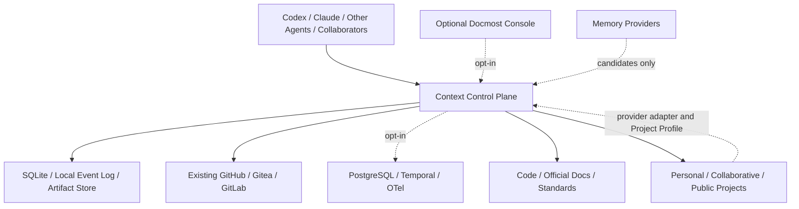

# Context Control Plane Target-State Architecture

版本：16  
日期：2026-08-28  
状态：current architecture contract  
governance authority：`MASTER.md` revision 115

## 三文档默认投影

Context Control Plane 安装到个人项目、协作项目或公开大型项目时，默认生成并维护三份人类与 Agent 共读文档：

| 文档 | 权限与内容 | 人类入口 | Agent 入口 |
|---|---|---|---|
| `MASTER.md` | 项目使命、边界、任务 DAG、治理决定和完成门；具有 governance authority | 审批主线、计划和 promotion | 按 active work ID 读取对应任务合同 |
| `STATUS.md` | active leaf、blocker、next action、revision 和最小恢复引用；Typed State 上线后生成 | 快速查看当前执行状态 | 每次恢复的第一个读取对象 |
| `docs/architecture/target-state.md` | 目标组件、权限、依赖方向、当前差距和验证归属 | 检查功能覆盖与架构完整性 | 按当前任务引用的组件行有界展开 |

三份文档使用稳定 ID、revision、authority、状态、evidence ref 和 completion gate 关联。运行时 Typed State 与 Event Log 保存高频动态事实；文档提供离线恢复、人类审阅和跨 Agent 的稳定投影。STATUS 不保存完整事件历史，MASTER 不吸收实验日志，目标态全表不保存当前 Session 叙事。

### 多项目 Session 路由

一个 Agent Session 可以服务多个独立项目，但项目身份必须由成功的显式
`continuity_resume(root=...)` 建立。每个 Session 保存受完整性校验的项目集合、当前
active root 和各项目 profile digest；切换到另一项目必须再次显式指定其 root。进程
`cwd` 只在尚未建立 Session binding 时作为发现提示，不能覆盖已绑定项目。未绑定、
profile digest 失配或损坏的 binding 在调用 State/Effect CLI 前拒绝；这条边界同样适用
于治理根与外部 delivery workspace 分离的多仓项目。一个项目内仍由该项目的 Work、
claim、lease 和 revision 独立裁决，切换项目不会复用另一项目的 claim。

## 目标态架构全表

下表使用 `context.*` 独立命名空间，归属 Context Control Plane。

| Slot | Module | 权限与功能 | Backend | 交付阶段 |
|---|---|---|---|---|
| `context.state` | `typed-state-store` | Project、Work、Claim、Idea、Decision、Constraint、Evidence、Blocker、Effect 与 Checkpoint 权威机器状态 | StateStore SPI；SQLite embedded 默认，PostgreSQL optional shared backend | M2 |
| `context.events` | `hash-chained-event-log` | 追加式事件、revision、supersedes、replay high watermark | StateStore SPI + artifact manifest | M2 |
| `context.work-coordination` | `shared-work-ledger` | 项目级 active work set、claim/lease、repo/path/symbol/capability/effect ownership、重复工作检测和冲突恢复；支持 modular、monolith 与 mixed topology | local State MCP + Git forge adapter；optional shared service | M2/M3/M8 |
| `context.collaboration-notification` | `realtime-agent-inbox` | 将 work claim、review、deploy intent、conflict 与 approval Event 按 tenant/project/subscription scope 分发；签名 Event/subscription/cursor/batch、State/evidence source verification、SSE Last-Event-ID、去重与离线补发已验证；WebSocket 按 provider capability 启用；inbox 保持 display-only | SQLite local event stream + optional shared relay + provider plugins | M8-10 local/shadow contract verified；M9 presentation；M10 live relay/key rotation |
| `context.forge-coordination` | `forge-work-adapter` | 将 Issue、PR、branch、assignee、review 和 CI 映射为共享 Work/claim/evidence projection；声明离线与未发布工作的保证缺口 | GitHub / Gitea / GitLab adapters | M8-08 offline contract verified；M10 live forge pilot |
| `context.task-routing` | `sticky-task-router` | 识别 continue、child、interrupt、switch、correction、discussion 和 blocking decision；普通 Idea 以 opaque ref 受控 capture、parking 或 switch proposal 保存，不能改变 active leaf、claim 或副作用权限；选择 next-ready required leaf | deterministic rules + bounded classifier | M3 |
| `context.workflow` | `durable-execution` | checkpoint、重试、幂等、lease、unattended required-work loop、multi-Agent fan-out/fan-in 和长流程恢复；长 campaign 采用 append-only step index/replay high watermark | local State MCP + SQLite cursor/port receipt；DBOS；Temporal 按需启用 | M8-09 local-embedded shadow contract verified；M8-10 scale decision verified；M10 step-index implementation/live pilot |
| `context.skill-resolution` | `versioned-skill-registry` | Skill manifest、五类 source catalog、version/hash 固定外部 adapter policy、pinned Git tree evidence、本地 CAS staging、metadata/admission 分层、offline replay、M4-07 candidate-only projection、M4-01 manifest schema reuse、M4-07 跨 entry dependency/cycle admission、M4-09 role/operation/provider resolver、同 kind OR/跨 kind AND、segment-prefix path、精确 provider contract、priority conflict、expiry quarantine、64 KiB preflight/canonical input、16,384 Unicode scalar/64 KiB UTF-8 content 与 128 KiB output bounded Project/User proposal、strict SemVer/ID/timestamp gate、set-like input canonicalization、Verification Profile license policy、expected-time-bound replay verifier、candidate-only body asset、固定 source/license/provenance、approval/verification evidence、stable rule IDs、dependency-closed compiled packet、drift quarantine、packet-bound S0-S3 load plan、selected manifest digest、exact provider applicability/contract、active-task compatibility lock、live input/adapter surface 重算、evidence-verified replay/rollback migration、gated composition entrypoint、host-owned authorization adapter 和 deterministic loader | Git + local artifact store + selected StateStore metadata | M4 |
| `context.composition` | `execution-packet-composer` | 组装当前任务、当前 Skill、当前 evidence 与 Continuation Cursor 的有界执行包 | State MCP + artifact store | M5 |
| `context.provider-integration` | `tiered-provider-adapters` | 默认 core adapter 仅加载 lifecycle hook 与 `<=512 B` startup projection，不注册 Skill、MCP 或命令门；auto compact 验证 checkpoint 后使用宿主原生续跑且零 packet 注入；bounded search 与 State 工具由独立可选 adapter 提供 | Codex core/search/state plugins；Claude 与其他 provider adapters | M4/M10/M11 |
| `context.replay` | `checkpoint-canary-validator` | 压缩、切任务、换模型、崩溃后的确定性恢复门 | deterministic validator | M1/M5 |
| `context.evidence` | `assertion-resolver` | 当前代码、标准、OS/软件官方文档的 version、validity 和 provenance | Git metadata、artifact store、`rg`、LSP、SCIP、RTFM | M6/M7 |
| `context.code-intelligence` | `bounded-code-retrieval` | 精确搜索、受影响图、跨仓线索和 index freshness | `rg`、Zoekt、LSP、SCIP、CodeGraph | M6 |
| `context.recall` | `candidate-memory-provider` | 提供偏好、历史讨论和时间性事实候选；权威提交权限为 0 | Hindsight / Mem0 / Graphiti SPI | M6 |
| `context.information-access` | `bounded-information-plane` | 最小读取范围、artifact range、retrieval receipt 和 freshness；`continuity context search` 查询 Git tracked current worktree 并限制完整 JSON bytes，绑定 revision 与 file/line hash | State MCP、artifact store、Git worktree、索引、Recall SPI | M5/M6/M11 |
| `context.adaptation` | `project-adaptation-loop` | 从已验证运行和明确纠正生成可审批、可回滚的 profile candidate；不得改变 active Work、claim、ownership、authorization、validator、evidence gate 或 effect 权限 | Typed State、OTel、A/B harness | M8-07 local/shadow contract verified；M10 production/profile migration |
| `context.review` | `independent-reviewer` | 冲突检查、阶段 handoff 和承重证据复核；权威提交权限为 0 | 本地或外置模型 | M6/M7 |
| `context.verification` | `continuous-integration-verifier` | push/PR 执行 test、compile、schema、projection、privacy、benchmark 和 secret gates；权威状态写权限为 0 | local verifier + Gitea Actions + Gitleaks | M0/M7/M8 |
| `context.observability` | `context-otel` | token、Skill 装载、检索、恢复、输入路由、Agent dispatch/handoff、误切、返工和质量指标 | OTel Collector + 可替换后端 | M8 |
| `context.presentation` | `human-visualization-plane` | Project Graph、Work Ledger、Decision Timeline、Constraint/Evidence Matrix、Context Health/Replay、Relationship/Impact 和受控审批共享同一 revisioned projection contract；M9-01..07 的 read、projection、governance、signed Markdown vault 与 force-layout seed 已验证；完整页面、Canvas/Bases 和跨前端 parity 由 Presentation SPI 管理；任何坐标、filter 或人类视图都不授予 State、completion、approval、provider 或 effect 权限 | optional Docmost + verified transport-neutral State MCP read provider；Obsidian generated read-only vault；CLI/Web adapters | M9-01..07 verified projection core；M9-08 Presentation SPI、M9-09 Obsidian graphical vault、M9-10 Docmost console、M9-11 parity planned；公开边界见 [`visual-products.md`](../../public/docs/visual-products.md) |
| `context.documentation` | `document-lifecycle-validator` | 生成并复验 document manifest、capacity、authority、change receipt、supersedes、evidence hash、duplicate prose 和 recovery fields | Git + repository verifier；外部 freshness 由 ReferenceWatcher | M0/M7 |

## Runtime Capability Profiles

Runtime profiles are not user editions. 下表定义可请求的部署模式、资源需求和预期失效边界；它本身不证明当前 adapter 提供对应保证。单人、多人、私有项目和公开项目均可请求任意 profile，激活仍受 capability conformance gate 约束。

Context Control Plane 作为一个 cohesive monolith 交付，使用统一安装、升级、迁移和卸载入口。State、Event、Checkpoint、Skill、检索、验证、adapter 与可选控制台属于同一产品的组合能力；启用 PostgreSQL、Docmost、Temporal 或 OTel 不会形成独立产品或用户等级。

| Profile | 默认状态 | 状态与协作位置 | 新增用户管理服务 | 一致性与权限边界 |
|---|---|---|---:|---|
| `local-embedded` | 默认 | 本机 SQLite + 本地 artifact store | 0 | 单机 revision/CAS；本机多 Agent 经同一 local State MCP；无跨设备唯一 claim |
| `forge-coordinated` | 检测到 remote 后 proposal | 每人本机 SQLite；GitHub/Gitea/GitLab 提供共享 Work projection | 0 | 对已发布 Issue/PR/branch/assignee 状态执行 expected revision/ref 检查；offline 与 unpublished Work 只在同步后显式冲突 |
| `local-coordinator` | opt-in | 一台成员设备运行 State MCP + SQLite，其他客户端连接 | 1 个控制面进程，数据库服务 0 | coordinator 可达期间提供共享 CAS/claim；失联客户端降级为 candidate/read-only |
| `shared-strong` | opt-in | State MCP + PostgreSQL；Temporal、Docmost、OTel 按需启用 | 由运行者管理 | 多 writer transaction/CAS、lease、tenant、audit 和长期 workflow |

StateStore capability manifest 必须声明 `shared_authority`、`offline_write`、`unique_claim`、`multi_writer`、`lease_clock`、`artifact_scope`、`expected_revision`、`migration_source` 和 `migration_target`。调用方只能使用 manifest 明确提供的保证。Project Profile 的 `requested_runtime_profile` 只表达部署意图；M10-09 激活门必须将其与已验证 manifest 对账。安装器默认选择 `local-embedded`；发现 Git remote 只生成 `forge-coordinated` proposal，不静默上传本地 checkpoint、Skill、个人偏好或历史记忆。

运行成本、SQLite transaction 边界、forge CAS 候选和跨平台验收见 [`state-store-portability-assessment-2026-08-10.md`](../research/state-store-portability-assessment-2026-08-10.md)。

依赖方向固定为：

项目级与个人工作边界见 [`project-work-governance.md`](project-work-governance.md)。Skill 编排见 [`skill-orchestration.md`](skill-orchestration.md)。Agent harness 见 [`../research/agent-harness-assessment-2026-08-09.md`](../research/agent-harness-assessment-2026-08-09.md)。`context.skill-resolution` 只负责版本化规则资产的发现、适用性判定、冲突处理和有界装载；Task、owner、claim、revision、checkpoint 和当前 evidence 由 Typed State、Event Log 和 State MCP 管理。

Project Profile 分别声明 direction state、governance owner mode、execution worker mode、repository topology、task sources 和 `requested_runtime_profile`。模块化、非模块化与混合仓库使用同一 Work/Claim/Event core schema，只切换 scope resolver。Foundation Sunshine 在 Platform 完工前按 monolith profile 协作；未来模块化 Platform 与收敛后的 Product 继续使用同一控制面协议。

## 公开项目 Markdown 准入

默认安装在目标项目 Git 中提交三文档投影和最小 Project Profile。项目明确采用的 policy、ADR、API 合同、sanitized fixture 和验收报告可以进入该项目；每个文件必须具有项目归属、license、provenance、更新触发和容量边界。

以下内容保留在控制面状态服务、受控 provider archive 或 artifact store：原始 transcript、模型 reasoning、用户私有习惯、完整 event/checkpoint 流、大日志、私有路径、密钥、未脱敏 evidence，以及与目标项目无直接采用关系的控制面研究库。本控制面仓库自身的 protocol、research、sanitized fixture 和 acceptance 文档属于产品交付与可复核证据，可以进入其公开 Git。

## 读取与完整性门

Agent 恢复顺序为 `STATUS -> MASTER active leaf -> target-state referenced rows -> evidence/artifact range`。完整 MASTER 和完整目标态全表只在治理审计、架构审计或 validator 失败时展开。

默认投影必须满足：

- STATUS active leaf 在 MASTER 中存在且状态一致；
- MASTER task 的组件引用在目标态全表中存在；
- 每个承重完成声明具有 current evidence 和 Verification Profile；
- 三文档 revision/digest 可关联，stale projection 在写操作前被 validator 拒绝；
- STATUS 不超过 12 KiB，MASTER 单个二级章节不超过 24 KiB；文档 manifest 的 path/category/hash/metrics/authority/change receipt/evidence ref 从当前文件重算一致；
- 三文档拆分后关键恢复字段保持 100%，直接读取 bytes 和重复检索量按 E5/M6-07 计量；
- 公开项目的默认 Markdown 集不包含原始会话、私密身份、密钥或未脱敏运行数据。
